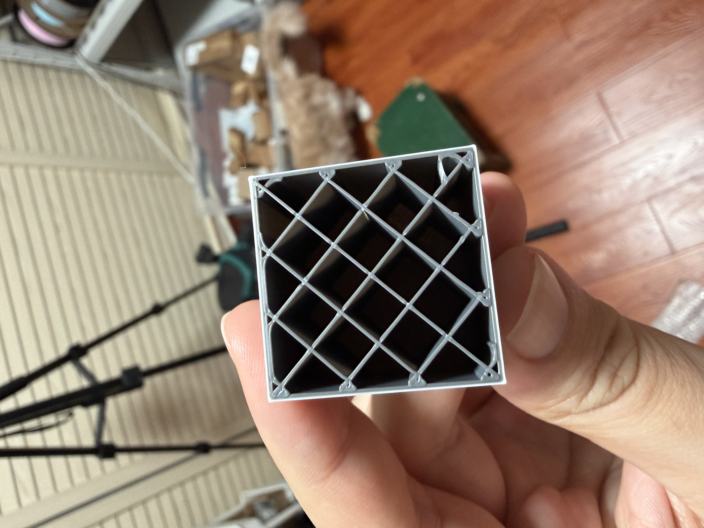

<h1> <p "font-size:200px;"> Snapmaker Orca</p> </h1>

[](https://github.com/Snapmaker/OrcaSlicer/actions/workflows/build_all.yml)
<br>Snapmaker Orca is an open source slicer for FDM printers based on OrcaSlicer.
 
## Experimental U1 Feature Build

### Alpha Download / Alpha 下载

📥 **[Download the Experimental U1 Alpha build](https://github.com/MOVIBALE/OrcaSlicer/releases/tag/u1-experimental-2.3.5-alpha.1)**

This pre-release page includes the Windows Installer, portable ZIP, source ZIP,
and SHA-256 checksums. It is an Experimental/Alpha build for U1 mixed-nozzle and
ESP32 Timelapse Box testing, not an official stable Snapmaker release.

📥 **[下载 U1 实验版 Alpha 构建](https://github.com/MOVIBALE/OrcaSlicer/releases/tag/u1-experimental-2.3.5-alpha.1)**

该 Pre-release 页面包含 Windows 安装包、便携 ZIP、源码 ZIP 和 SHA-256
校验值。这是用于 U1 多口径/混合喷嘴与 ESP32 延时摄影盒子测试的
Experimental/Alpha 版本，不是官方稳定版。

This fork branch contains an experimental Snapmaker U1 mixed-nozzle workflow.
It is not an official Snapmaker release.

The first validated hardware setup is:

- 0.2 mm nozzle for visible outer walls.
- 0.4 mm nozzle for inner walls and infill.

The slicer side is now modelled as two selectable modes, so other nozzle
diameter pairs should be configured by changing nozzle diameters, feature
filaments, and line widths instead of adding fixed process presets:

- Same layer, different line widths.
- Mixed layer, different line widths.

Main changes in this branch:

- U1 nozzle diameters can be edited independently per toolhead.
- Nozzle tabs show the selected diameter.
- `outer_wall_filament` routes external perimeters to a different tool than inner walls.
- The Prepare sidebar includes a Mixed Nozzle workstation for quick plans,
  nozzle mapping, feature assignment, layer combining, and validation.
- `mixed_nozzle_mode` selects same-layer or mixed-layer slicing.
- Mixed-layer mode uses automatic coarse layer height targeting by default.
  Sparse infill is the conservative default; inner wall and internal solid
  infill combining are explicit experimental switches.
- Printer filament sync reads U1 head-slot material/nozzle information and maps physical heads to logical T-slots through `extruder_map_table`.
- `scripts/check_mixed_nozzle_gcode.py` validates exported role/tool G-code.
- Two starter U1 process profiles are included as mode examples.
- A matching U1 firmware validation patch is required for mixed-nozzle G-code.
- Optional ESP32 Timelapse Box support emits `ESP_TIMELAPSE_SHOT` for Klipper
  while retaining the printer's native timelapse command.

Real Snapmaker U1 mixed-nozzle print validation passed on 2026-06-18:



Read the full mixed-nozzle notes before using this branch:

- [Mixed-nozzle U1 README](docs/mixed-nozzle-u1/README.md)
- [中文说明](docs/mixed-nozzle-u1/README.zh-CN.md)
- [Release notes](docs/mixed-nozzle-u1/RELEASE_NOTES.md)
- [中文发布说明](docs/mixed-nozzle-u1/RELEASE_NOTES.zh-CN.md)
- [GitHub release draft](docs/mixed-nozzle-u1/GITHUB_RELEASE_DRAFT.md)
- [中文 GitHub Release 草稿](docs/mixed-nozzle-u1/GITHUB_RELEASE_DRAFT.zh-CN.md)
- [ESP32 Timelapse Box](docs/esp32-timelapse/README.md)
- [ESP32 延时摄影盒子](docs/esp32-timelapse/README.zh-CN.md)
- Matching firmware branch: [MOVIBALE/SnapmakerU1-Extended-Firmware mixed-nozzle-u1](https://github.com/MOVIBALE/SnapmakerU1-Extended-Firmware/tree/mixed-nozzle-u1)

Use this branch only if you can recover the printer firmware and are comfortable
testing experimental slicer and firmware behavior.

The mixed-nozzle validation patch is required only for mixed-nozzle printing.
ESP32 timelapse uses the Klipper macro boundary and does not depend on the
modified U1 firmware.

To return to the official slicer, uninstall this experimental build and install
the latest release from [Snapmaker/OrcaSlicer](https://github.com/Snapmaker/OrcaSlicer/releases).
Back up custom presets and projects first. Restoring the slicer does not restore
printer firmware; reflash a known-good official or extended firmware image
separately when leaving the mixed-nozzle firmware test.


# Download

### Stable Release
📥 **[Download the Latest Stable Release](https://github.com/Snapmaker/OrcaSlicer/releases/latest)**  
Visit our GitHub Releases page for the latest stable version of Snapmaker Slicer, recommended for most users.

# How to install
**Windows**: 
1.  Download the installer for your preferred version from the [releases page](https://github.com/Snapmaker/OrcaSlicer/releases).
    - *For convenience there is also a portable build available.*
    - *If you have troubles to run the build, you might need to install following runtimes:*
      - [MicrosoftEdgeWebView2RuntimeInstallerX64](https://github.com/SoftFever/OrcaSlicer/releases/download/v1.0.10-sf2/MicrosoftEdgeWebView2RuntimeInstallerX64.exe)
          - [Details of this runtime](https://aka.ms/webview2)
          - [Alternative Download Link Hosted by Microsoft](https://go.microsoft.com/fwlink/p/?LinkId=2124703)
      - [vcredist2019_x64](https://github.com/SoftFever/OrcaSlicer/releases/download/v1.0.10-sf2/vcredist2019_x64.exe)
          -  [Alternative Download Link Hosted by Microsoft](https://aka.ms/vs/17/release/vc_redist.x64.exe)
          -  This file may already be available on your computer if you've installed visual studio.  Check the following location: `%VCINSTALLDIR%Redist\MSVC\v142`

**Mac**:
1. Download the DMG for your computer: `arm64` version for Apple Silicon and `x86_64` for Intel CPU.  
2. Drag Snapmaker_Orca.app to Application folder. 
3. *If you want to run a build from a PR, you also need to follow the instructions below:*  
    <details quarantine>
    - Option 1 (You only need to do this once. After that the app can be opened normally.):
      - Step 1: Hold _cmd_ and right click the app, from the context menu choose **Open**.
      - Step 2: A warning window will pop up, click _Open_  
      
    - Option 2:  
      Execute this command in terminal: `xattr -dr com.apple.quarantine /Applications/Snapmaker_Orca.app`
      ```console
          softfever@mac:~$ xattr -dr com.apple.quarantine /Applications/Snapmaker_Orca.app
      ```
    - Option 3:  
        - Step 1: open the app, a warning window will pop up  
              
        - Step 2: in `System Settings` -> `Privacy & Security`, click `Open Anyway`:  
              
    </details>
    
**Linux (Ubuntu)**:
 1. If you run into trouble executing it, try this command in the terminal:  
    `chmod +x /path_to_appimage/Snapmaker_Orca_Linux.AppImage`
    
# How to compile
- Windows 64-bit  
  - Tools needed: Visual Studio 2019, Cmake, git, git-lfs, Strawberry Perl.
      - You will require cmake version 3.14 or later, which is available [on their website](https://cmake.org/download/).
      - Strawberry Perl is [available on their GitHub repository](https://github.com/StrawberryPerl/Perl-Dist-Strawberry/releases/).
  - Run `build_release.bat` in `x64 Native Tools Command Prompt for VS 2019`
  - Note: Don't forget to run `git lfs pull` after cloning the repository to download tools on Windows

- Mac 64-bit  
  - Tools needed: Xcode, Cmake, git, gettext, libtool, automake, autoconf, texinfo
      - You can install most of them by running `brew install cmake gettext libtool automake autoconf texinfo`
  - run `build_release_macos.sh`
  - To build and debug in Xcode:
      - run `Xcode.app`
      - open ``build_`arch`/Snapmaker_Orca.Xcodeproj``
      - menu bar: Product => Scheme => Snapmaker_Orca
      - menu bar: Product => Scheme => Edit Scheme...
          - Run => Info tab => Build Configuration: `RelWithDebInfo`
          - Run => Options tab => Document Versions: uncheck `Allow debugging when browsing versions`
      - menu bar: Product => Run

- Ubuntu 
  - Dependencies **Will be auto-installed with the shell script**: `libmspack-dev libgstreamerd-3-dev libsecret-1-dev libwebkit2gtk-4.0-dev libosmesa6-dev libssl-dev libcurl4-openssl-dev eglexternalplatform-dev libudev-dev libdbus-1-dev extra-cmake-modules libgtk2.0-dev libglew-dev libudev-dev libdbus-1-dev cmake git texinfo`
  - run 'sudo ./BuildLinux.sh -u'
  - run './BuildLinux.sh -dsir'


# Note: 
If you're running Klipper, it's recommended to add the following configuration to your `printer.cfg` file.
```
# Enable object exclusion
[exclude_object]

# Enable arcs support
[gcode_arcs]
resolution: 0.1
```


## Some background
Snapmaker Orca is originally forked from Snapmaker_Orca.

Snapmaker_Orca is originally forked from Bambu Studio, it was previously known as BambuStudio-SoftFever.
Bambu Studio is forked from [PrusaSlicer](https://github.com/prusa3d/PrusaSlicer) by Prusa Research, which is from [Slic3r](https://github.com/Slic3r/Slic3r) by Alessandro Ranellucci and the RepRap community. 
Orca Slicer incorporates a lot of features from SuperSlicer by @supermerill
Orca Slicer's logo is designed by community member Justin Levine(@freejstnalxndr)  


# License
Snapmaker Orca is licensed under the GNU Affero General Public License, version 3. Orca Slicer is based on Snapmaker_Orca by SoftFever

Orca Slicer is licensed under the GNU Affero General Public License, version 3. Orca Slicer is based on Bambu Studio by BambuLab.

Bambu Studio is licensed under the GNU Affero General Public License, version 3. Bambu Studio is based on PrusaSlicer by PrusaResearch.

PrusaSlicer is licensed under the GNU Affero General Public License, version 3. PrusaSlicer is owned by Prusa Research. PrusaSlicer is originally based on Slic3r by Alessandro Ranellucci.

Slic3r is licensed under the GNU Affero General Public License, version 3. Slic3r was created by Alessandro Ranellucci with the help of many other contributors.

The GNU Affero General Public License, version 3 ensures that if you use any part of this software in any way (even behind a web server), your software must be released under the same license.

Orca Slicer includes a pressure advance calibration pattern test adapted from Andrew Ellis' generator, which is licensed under GNU General Public License, version 3. Ellis' generator is itself adapted from a generator developed by Sineos for Marlin, which is licensed under GNU General Public License, version 3.

The Bambu networking plugin is based on non-free libraries from BambuLab. It is optional to the Orca Slicer and provides extended functionalities for Bambulab printer users.

# Feedback & Contribution
We greatly value feedback and contributions from our users. Your feedback will help us to further develop Snapmaker Orca for our community.
- To submit a bug or feature request, file an issue in GitHub Issues or email us at support@snapmaker.com.
- To contribute some code, make sure you have read and followed our guidelines for contributing.
